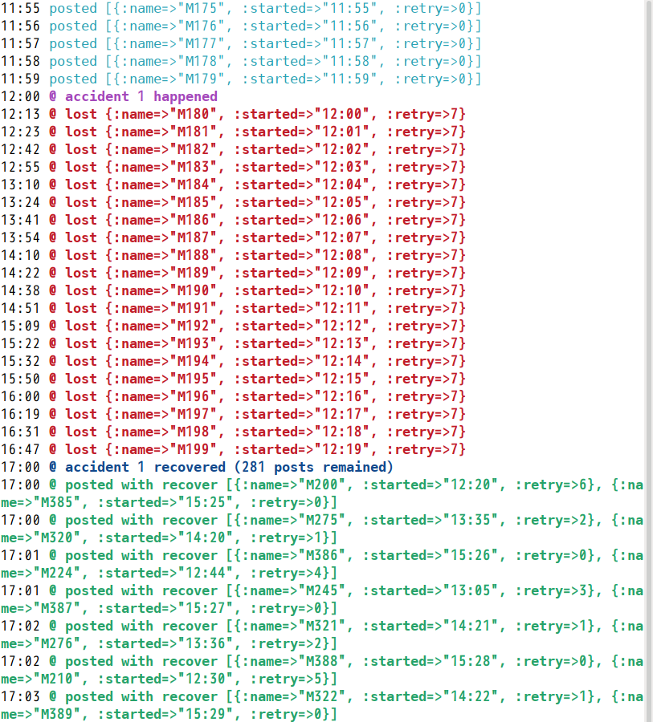

# mackerel-agentのキューがどう処理されるかのシミュレーション

Copyright 2023 Kenshi Muto

## 概要

[Mackerel](https://mackerel.io/)のエージェントである[mackerel-agent](https://github.com/mackerelio/mackerel-agent) のホストメトリックがネットワーク障害でうまく送れなかったときに、どのような挙動で解消していくのか、あるいはどのような状況に置かれるとメトリックをやむなく捨てるのかをシミュレートします。



私のGo言語のコードリーディング力が不足しているために、実際の挙動とは大きく異なる可能性があることをご理解ください。実際のmackerel-agentでは同時送出を避けるための開始遅延やプラグイン待ちなどの処理、メトリックのタイミングの違いもありますが、本シミュレーションでは単純化しています。

## 設定

`config.yml` をシミュレート用に設定します。

- `max_retry`: メトリックの再送最大回数。本物のmackerel-agentでは360。これだとまずlostしないので、単純な実験としては無理矢理小さい値にすることになる
- `during`: 実行期間。開始、終了を「日付`T`時間」の記法で記載する
- `accidents`: 障害タイミング。「発生の時刻」「復旧の時刻」の配列を1つの単位として、それを配列で囲む
- `quiet`: 正常な投稿を出力したくないときにはtrueにする

## 実行

```
bundle exec queue-simulation.rb
```

見方は以下のとおりです。

- `{:name=>"M〜", :started="HH:MM", :retry=>N}`: 1分ごとにエージェントが取り込むメトリックを模したもの。Mの数字は開始以降の分のカウンタで、startedにその時刻が入っている。retryはその名のとおり再送のリトライ回数
- `posted`: 正常に投稿された（1分ごと）
- `@ posted with recover`: キュー処理モードで投稿された（30秒ごと）
- `@ lost`: キュー内のリトライ回数が上限に達して投稿対象から捨てられた
- `@ accident X happened`: ネットワーク障害が発生した
- `@ accident X recovered`: ネットワーク障害から復旧した

## あとがき

実際のmackerel-agentのコードではキューのリトライ上限は60×6=360ですので、相当長期にネットワークの障害があるということがない限り、ホストメトリックが失われるということはなさそう、と思われます。また、単純に古いものを消していくのではなく、キューバッファの許す限りでリトライ対象をバラけさせることで、キューからの消失をできるだけ防ぐ手段が技巧的でした。

とはいえ、メトリックはメモリ上に記録しているので、当然ながらOS自体が再起動したとか、mackerel-agentがOOM killされてしまったといった事象には対応できないことには注意が必要です。

Goコードを読み始めたのはごく最近なのですが、『初めてのGo言語』（オライリー・ジャパン）がとても役立っていることをここに記し、感謝にかえさせていただきます。

## ライセンス

```
Permission is hereby granted, free of charge, to any person obtaining a
copy of this software and associated documentation files (the "Software"),
to deal in the Software without restriction, including without limitation
the rights to use, copy, modify, merge, publish, distribute, sublicense,
and/or sell copies of the Software, and to permit persons to whom the
Software is furnished to do so, subject to the following conditions:

The above copyright notice and this permission notice shall be included in
all copies or substantial portions of the Software.

THE SOFTWARE IS PROVIDED "AS IS", WITHOUT WARRANTY OF ANY KIND, EXPRESS OR
IMPLIED, INCLUDING BUT NOT LIMITED TO THE WARRANTIES OF MERCHANTABILITY,
FITNESS FOR A PARTICULAR PURPOSE AND NONINFRINGEMENT.  IN NO EVENT SHALL
SOFTWARE IN THE PUBLIC INTEREST, INC. BE LIABLE FOR ANY CLAIM, DAMAGES OR
OTHER LIABILITY, WHETHER IN AN ACTION OF CONTRACT, TORT OR OTHERWISE,
ARISING FROM, OUT OF OR IN CONNECTION WITH THE SOFTWARE OR THE USE OR OTHER
DEALINGS IN THE SOFTWARE.
```

